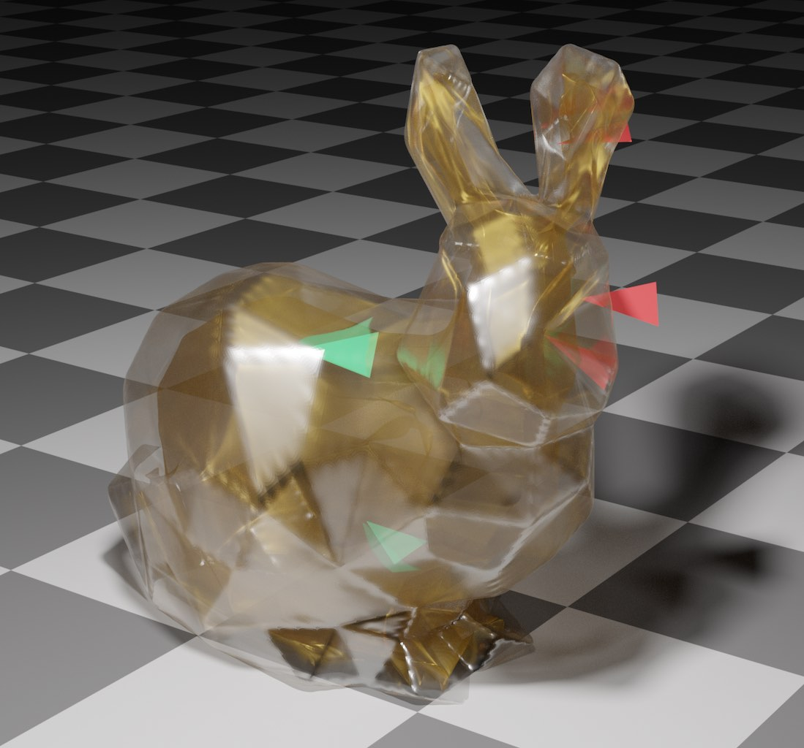

# Exact and Efficient Polyhedral Envelope Containment Check




If you use our code, please cite our paper
```bibtex
@article{Wang:2020:FE,
    title={Exact and Efficient Polyhedral Envelope Containment Check},
    author={Bolun Wang and Teseo Schneider and Yixin Hu and Marco Attene and Daniele Panozzo},
    journal = {ACM Trans. Graph.},
     volume = {39},
     number = {4},
     month = jul,
     year = {2020},
     publisher = {ACM}
}
```
Please click [HERE](https://cims.nyu.edu/gcl/papers/2020-Fast-Envelope.pdf) to download the paper.
This is the link of our talk on SIGGRAPH 2020 [https://www.youtube.com/watch?v=_Vm61nlxyBI](https://www.youtube.com/watch?v=_Vm61nlxyBI).

## Important Note
There is a compiler flag which is required for ensuring the correctness of the algorithm.
The flag is not available on clang. The code has been tested on GCC and Windows compiler.


# Installation via CMake
 - clone our repository in your dependency folder (or add it as submodule)
 - add this in your main `CMakeLists.txt` file `add_subdirectory` pointing to the directory where you cloned this repository
 - link your target with our library `target_link_libraries(<your-target> PUBLIC FastEnvelope)`

 ## Note
 Our library requires standard predicates to work, by default we use the fast predicates inside [Geogram](http://alice.loria.fr/software/geogram/doc/html/index.html). If you want to avoid having Geogram as dependency, you can disable it by setting `FAST_ENVELOPE_WITH_GEOGRAM_PSM_PREDICATES` to `ON`. The code will be slower.

 # Usage
  - Include `#include <fastenvelope/FastEnvelope.h>`
  - Initialize the envelope checker `FastEnvelope(const std::vector<Vector3>& m_ver, const std::vector<Vector3i>& m_faces, const Scalar eps);` with vertices, connectivity, and envelope size.
  - Call one of the `is_outside` function with a triangle, point, or segment.


 # Testing
 We also provide an executable target `FastEnvelope_bin` that can be used for benchmarking

 You can run it by:
```bash
./FastEnvelope_bin ./queries/<INPUT>_envelope_log.csv ./ftetwild_queries/<INPUT> <OUTPUT> 1e-3 1 ours
```

# Data
All data used in our paper can be downloaded from [https://archive.nyu.edu/handle/2451/61221](https://archive.nyu.edu/handle/2451/61221).
